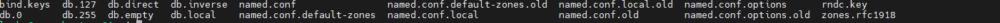
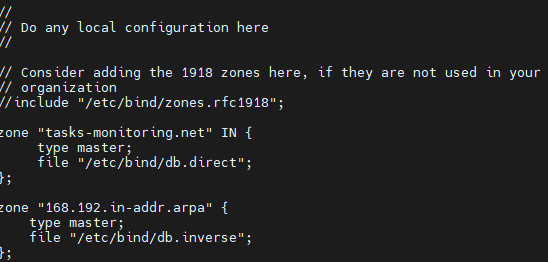
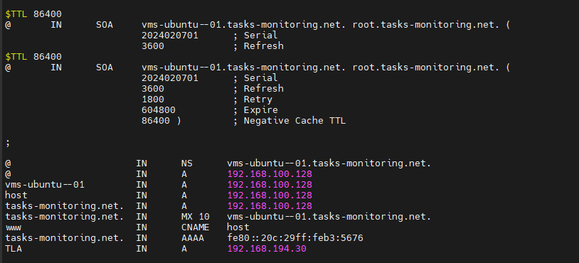
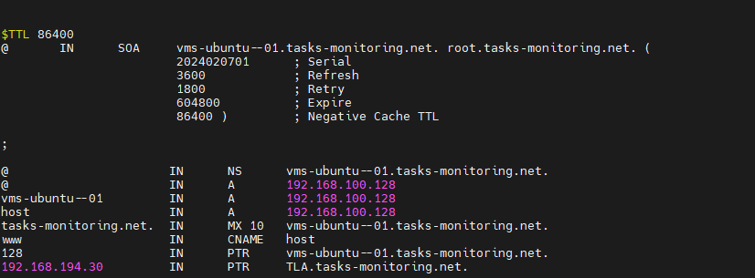

# Mettre en place un serveur web sur debian (apache 2)
-> 
# Mettre en place un serveur dns sur debian (bind9) afin de resoudre le nom de domaine de notre application
`apt install bind9 -y`
`apt install dnsutils -y` 

Il existe des fichiers de configurations de base sur bind9 

+ On va rajouter dans le fichier name.conf.local le chemin de deux fichiers une zone directe et une zone inverse.

   
+ zone directe
    C'est dans ce fichier qu'on va définir les types d'enregistrements que l'on souhaite pour DN afin de le resoudre à l'ip du serveur.
    
     

+ zone inverse 
     
     
`systemctl restart bind9`

